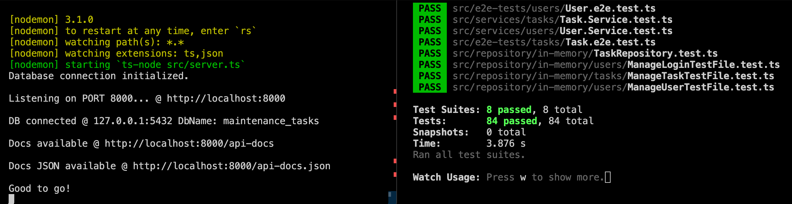

# Skeleton 
#### Factory-Dependency-Injection-UnitTests-E2ETests

## Skeleton
- Project structure
- OOP
- TDD
- Task entity
- In-Memory repository
- Unit tests
- E2E tests
- Swagger API Docs.
- User entity
- Persist data with Postgres
- Migrations;
- Factory for dependency injection;


##### Work in progress:

- [ ] Integrate Users authentication (JWT) for Tasks management;


### Tests:

- Besides using Jest for Unit Tests, it's using Super Jest for E2E Test and you can switch them using the environment variable 'ENABLE_E2E_TESTS' with 'Y' (yes) or 'N'(no) in .env file.
- Check the package.json for the scripts to run each mode.


### To run the project:

1. Clone this repo
2. Run `npm install`
3. Run `nvm install 20` and `nvm use`. Now we're on the same page.
4. Define env variables:
````
```
# server
PORT=8000

# local
SERVER_ADDRESS=http://localhost

# database
DB_HOST=127.0.0.1
DB_PORT=5432
DB_USER=postgres
DB_PASSWORD=mysecretpassword
DB_NAME=maintenance_tasks

# users and tokens
PASSWORD_MIN_SIZE=8
PASSWORD_MAX_SIZE=100
JWT_SECRET= 
ACCESS_TOKEN_SECRET=
REFRESH_TOKEN_SECRET=

# Enable = Y (meaning yes) or Disable = N (meaning no) the e2e tests
ENABLE_E2E_TESTS=Y
```
````

5. Create and start the Postgres docker:
```docker run --name user-postgres -p 5432:5432 -e POSTGRES_PASSWORD=mysecretpassword -d postgres```
_Give it a minute to be sure the service is 100% up_

6. Migrations (_to create the tables and populate - only for 1st time run_:
- _First, you need to run ```npm run start-nodemon``` at least once to create the database if it does not exist yet_
- Then run migrations and seeds:
```knex migrate:latest --knexfile ./db/knexfile.cjs --migrations-directory migrations``` 
- Seed (if you want a few records already there) _optional_:
_This seeding will create 1 manager, 2 technicians and 2 tasks_
_The password for the 3 users created will be each email user (until the @) + 123. For example, john.manager@123 will be the password for the manager john.manager@email.com_
run the seed command:
```knex seed:run --knexfile ./db/knexfile.cjs```

7. Run ```npm run start-nodemon``` and ```npm t```

